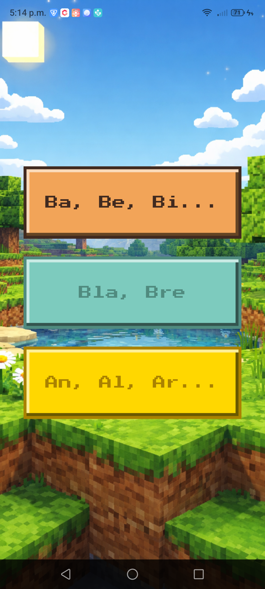
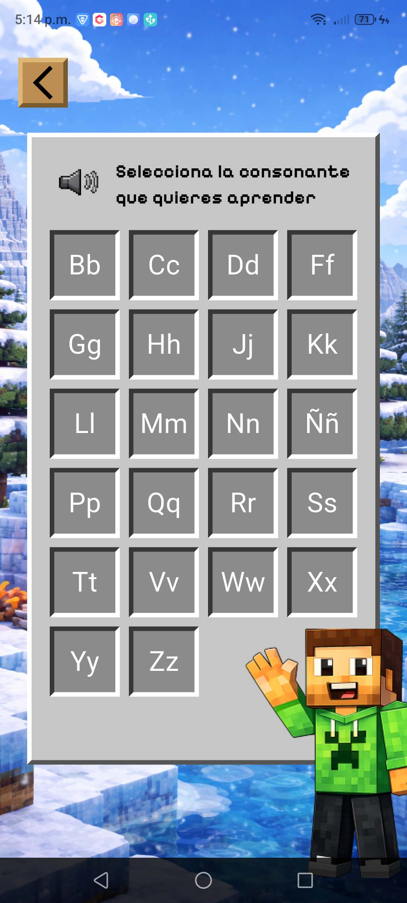

# 🟫 Learning to Read with Blocks

Una aplicación educativa hecha con **Flutter** para que los niños aprendan a leer en español, con una temática visual inspirada en **Minecraft**.

## 🎮 ¿De qué trata?

La app guía a los niños paso a paso por la lectura de **sílabas** en español. El niño selecciona una consonante y la app le muestra todas las sílabas que se forman al combinarla con las cinco vocales (a, e, i, o, u), tanto en mayúscula como en minúscula. Al tocar una sílaba, la app la **pronuncia en voz alta** usando text-to-speech.

Todo esto envuelto en una interfaz estilo Minecraft: botones con bordes biselados de diamante, piedra y madera, un inventario de consonantes, fondos pixelados y un personaje guía llamado **Piñeyrin**.


## 📱 Capturas de pantalla

A continuación se muestran algunas capturas del desarrollo de la app:

<p align="center">
    
    
    
    
</p>

| Pantalla | Descripción |
|---|---|
| **Splash** | Logo de PiñeyroSoft con transición animada |
| **Home** | Pantalla principal con logo del juego y botón "Jugar" |
| **Menú de Consonantes** | Inventario estilo Minecraft con 22 consonantes en una cuadrícula |
| **Sílabas** | Muestra las 10 sílabas (5 mayúsculas + 5 minúsculas) de la consonante seleccionada |

## 🛠️ Tecnologías

- **Flutter** (SDK ^3.10.4)
- **flutter_tts** — Text-to-speech para pronunciar sílabas en español
- **google_fonts** — Tipografía Pixelify Sans y Press Start 2P (estilo pixel art)
- **flutter_svg** — Soporte para assets SVG


## 🚀 Cómo ejecutar

```bash
# Instalar dependencias
flutter pub get

# Ejecutar en Chrome
flutter run -d chrome

# Ejecutar en Android
flutter run
```

## 📝 Licencia

Este proyecto es **open source** bajo la licencia [MIT](LICENSE).

Desarrollado por **[JasubiP](https://jasubip.com)**.
